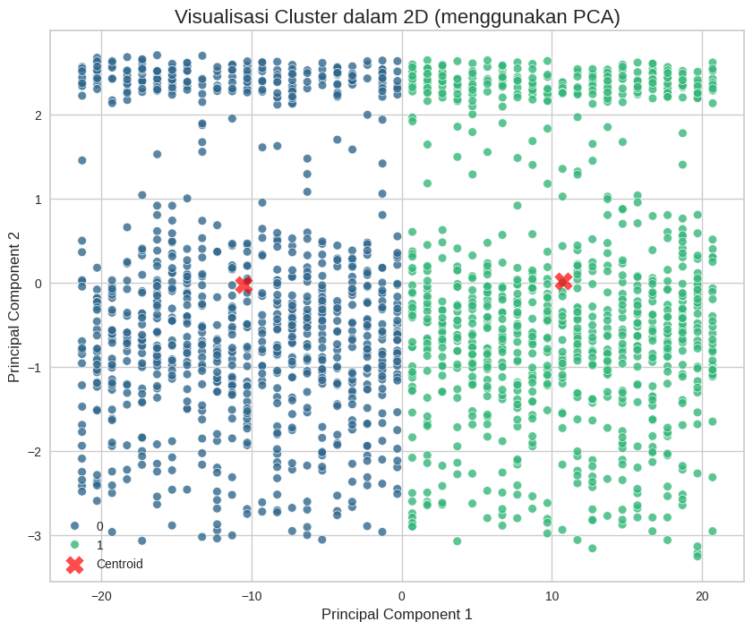

# Clustering + Classification

A two-stage machine-learning pipeline on banking transaction data: **discover customer segments** with unsupervised clustering, then **train a classifier to predict** those segments on new records.

  

## Overview

- **Clustering** — [`clustering.ipynb`](./notebooks/clustering.ipynb): K-Means groups customers into segments; PCA projects the high-dimensional features to 2D for the visualization above.
- **Classification** — [`classification.ipynb`](./notebooks/classification.ipynb): Decision Tree and Random Forest models are trained (and tuned) to predict a customer's cluster from their features.

Exploratory analysis of the feature correlations that drive the segmentation:

  

## Tech stack

Python · scikit-learn · pandas · PCA · K-Means · Decision Tree · Random Forest · Matplotlib · seaborn

## Notes

Final project for Dicoding's *Belajar Machine Learning untuk Pemula*. Trained models are saved as `.h5` artifacts alongside the notebooks.
